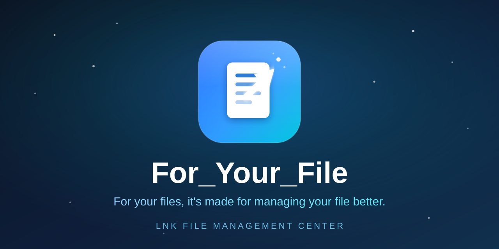

<div dir="rtl">

# مركز إدارة اختصارات LNK

> تطبيق سطح مكتب حديث لإدارة اختصارات Windows .lnk، مبني على Tauri 2.0.

[中文](README-zh.md) | [English](README.md) | [Français](README-fr.md) | [Русский](README-ru.md) | العربية


يساعدك مركز إدارة اختصارات LNK على إدارة اختصارات Windows (.lnk) في مكان واحد. بفضل البحث النصي الكامل، التجميع الذكي، تنبيهات انتهاء الصلاحية، الاختصارات العالمية، والفتح بنقرة واحدة، يمكنك التخلص من الفوضى الناتجة عن اختصارات سطح المكتب وقائمة Start المبعثرة.

## ✨ المميزات

- **🔍 البحث النصي الكامل** — بحث SQLite FTS5 في الوقت الفعلي مع مطابقة البادئة، الترحيل، سجل البحث، وتمييز الكلمات المفتاحية
- **📁 فحص التطبيقات** — فحص التطبيقات تلقائيًا من قائمة Start، واستخراج أيقونات Win32 الأصلية، مع تخزين مؤقت على القرص (تحميل فوري تقريبًا)
- **🚀 التشغيل بنقرة واحدة** — انقر نقرتين لبدء التطبيق أو فتح ملف أو مجلد أو رابط URL، مع تتبع تكرار الاستخدام تلقائيًا
- **🖥️ الاختصارات العالمية** — اختصارات عالمية قابلة للتخصيص (افتراضيًا `Alt+Space`)، اكتشاف التعارضات واقتراحات الحل
- **⏰ تنبيهات انتهاء الصلاحية** — اضبط تاريخ انتهاء صلاحية الملفات المؤقتة، واستقبل التنبيهات أو نظفها مجمعة عند انتهاء صلاحيتها
- **📚 التجميع الذكي** — 8 ألوان للتجميع، تعيين بالسحب والإفلات، عمليات مجمعة، واستيراد/تصدير المجموعات (JSON/CSV/HTML)
- **📦 الاستيراد المجمع** — اسحب وأفلت أو تصفح لاستيراد عناصر متعددة، مع إعداد علامات/معلمات/طريقة الفتح بشكل موحد، ومؤشر تقدم مباشر
- **🗃️ معاينة قاعدة البيانات** — افحص قاعدة البيانات المحلية الكاملة في نافذة منفصلة مع تقدم حقيقي وترحيل محدود
- **🌐 التدويل** — يدعم الصينية والإنجليزية والفرنسية والروسية والعربية
- **🎨 تبديل السمة** — سمة فاتحة/داكنة مع حفظ تفضيلات المستخدم
- **🖱️ قائمة السياق** — تكامل مع قائمة السياق في Windows Explorer لإضافة العناصر بسرعة
- **🔗 الروابط العميقة** — دعم بروتوكول `filemgmt://` لأوامر add/open/search/settings
- **🧩 تكامل PPC** — الاتصال بنظام PPC المركزي (v0.0.7) مع تعيين رموز الأخطاء
- **🖥️ علبة النظام** — الإخفاء في علبة النظام عند الإغلاق، مع استدعاء سريع من الاختصار أو العلبة

## 🛠️ مكدس التقنيات

| الطبقة | التقنية |
|----|------|
| الإطار | Tauri 2.0 |
| الواجهة الأمامية | React 18 + TypeScript 5 |
| أداة البناء | Vite 5 |
| التنسيق | Tailwind CSS 3 |
| الرسوم المتحركة | Framer Motion |
| الخادم الخلفي | Rust (edition 2021) |
| قاعدة البيانات | SQLite (rusqlite, bundled) + بحث FTS5 كامل |
| التدويل | i18next (en/zh/fr/ru/ar) |
| استخراج الأيقونات | Win32 API (SHGetFileInfoW + GDI) |

## 📋 المتطلبات

- **نظام التشغيل**: Windows 10 / Windows 11
- **وقت التشغيل**: Microsoft Edge WebView2 Runtime (مُثبت مسبقًا على Windows 11، ومطلوب على Windows 10)
- **التطوير**: Rust 1.77.2+، Node.js 18+

## 🚀 البداية السريعة

### وضع التطوير

```bash
# 1. تثبيت تبعيات الواجهة الأمامية
npm install

# 2. تشغيل خادم التطوير (المنفذ الافتراضي 1420)
npm run dev
```

### بناء الإنتاج

الإصدار 0.0.4+ يعطل تجميع Tauri (`bundle.active: false`). يقوم CI بالفحص والترجمة فقط.

```bash
# الخيار 1: الترجمة المباشرة (مستحسن، بدون مثبت)
cargo build --manifest-path src-tauri/Cargo.toml --release --no-default-features

# الخيار 2: بناء Tauri كامل (واجهة + خلفية، لكن exe خام فقط)
npx tauri build
```

المخرجات: `src-tauri/target/release/lnk-file-management-center.exe` (ملف ثنائي واحد، بدون MSI/NSIS)

> **إذا احتجت إلى مثبت**: عيّن مؤقتًا `"bundle.active": true`, `"targets": ["nsis"]` في `tauri.conf.json`، ثم أعد الوضع بعد البناء. لا تُدخل تغييرات المثبت في commits.

## 📂 هيكل المشروع

```text
For_Your_File/
├── src/                          # واجهة React الأمامية
│   ├── components/               # مكونات واجهة المستخدم (30+)
│   │   ├── BatchImportModal.tsx  # الاستيراد المجمع (شريط التقدم / ملخص الأخطاء)
│   │   ├── AppSelectorModal.tsx  # محدد التطبيقات (تخزين مؤقت للأيقونات / التحكم في التزامن)
│   │   └── ...
│   ├── hooks/                    # Hooks مخصصة (مثل useSearch)
│   ├── locales/                  # ترجمات 5 لغات
│   ├── types/                    # أنواع TypeScript
│   └── App.tsx                   # التطبيق الرئيسي
├── src-tauri/                    # الخلفية Rust
│   ├── src/
│   │   ├── commands.rs           # أكثر من 60 أمرًا Tauri
│   │   ├── db.rs                 # مخطط SQLite + مشغلات FTS5
│   │   ├── hotkey.rs             # إدارة الاختصارات العالمية
│   │   ├── lnk.rs                # تحليل ملفات LNK (COM/IShellLinkW)
│   │   ├── app_scanner.rs        # فحص قائمة Start + استخراج الأيقونات الأصلية
│   │   ├── expiration/           # نظام تنبيهات انتهاء الصلاحية
│   │   ├── ppc_linker.rs         # تكامل PPC
│   │   └── ...
│   ├── tests/                    # اختبارات تكامل Rust
│   └── tauri.conf.json           # إعدادات Tauri
├── docs/                         # الوثائق
│   ├── tech/                     # وثائق تقنية
│   └── user/                     # دليل المستخدم
├── .github/workflows/ci.yml      # CI (فحص + ترجمة، بدون حزمة)
├── package.json
└── LICENSE.md                    # GPL-3.0
```

## 🧪 الاختبارات

```bash
# فحص أنواع الواجهة الأمامية
npm run type-check

# اختبارات Rust للوحدات والتكامل
cd src-tauri && cargo test

# فحص Clippy
cargo clippy -- -D warnings

# فحص التنسيق
cargo fmt -- --check
```

## 🔧 قاعدة البيانات

- **الموقع**: `%APPDATA%/wang.station/app/For_Your_File/lnk_management.db`
- **الجداول**: `entries` (العناصر)، `groups` (المجموعات)، `entry_groups` (علاقة many-to-many)، `entries_fts` (فهرس البحث النصي FTS5)
- **ذاكرة أيقونات مؤقتة**: `%APPDATA%/wang.station/app/For_Your_File/icon_cache/` (مفتاح تجزئة + إبطال حسب وقت التعديل)

## 📄 الوثائق

- [الوثائق التقنية](docs/tech/README.md) — البنية، مرجع API، تصميم قاعدة البيانات، البناء والنشر
- [دليل المستخدم](docs/user/README.md) — التثبيت، استخدام الميزات، الاختصارات، FAQ، استكشاف الأخطاء

## 🤝 المساهمة

نرحب بالمساهمات من خلال Issues و Pull Requests. يرجى التأكد من:

1. أن يمر الكود عبر `cargo fmt` و `cargo clippy`
2. نجاح الاختبارات (`cargo test`)
3. أن توضح رسائل الالتزام التغييرات بوضوح

## 📜 الترخيص

هذا المشروع مفتوح المصدر بموجب [رخصة GNU General Public License v3.0](LICENSE.md).

Copyright © 2026 LNK File Management Center Contributors

</div>
