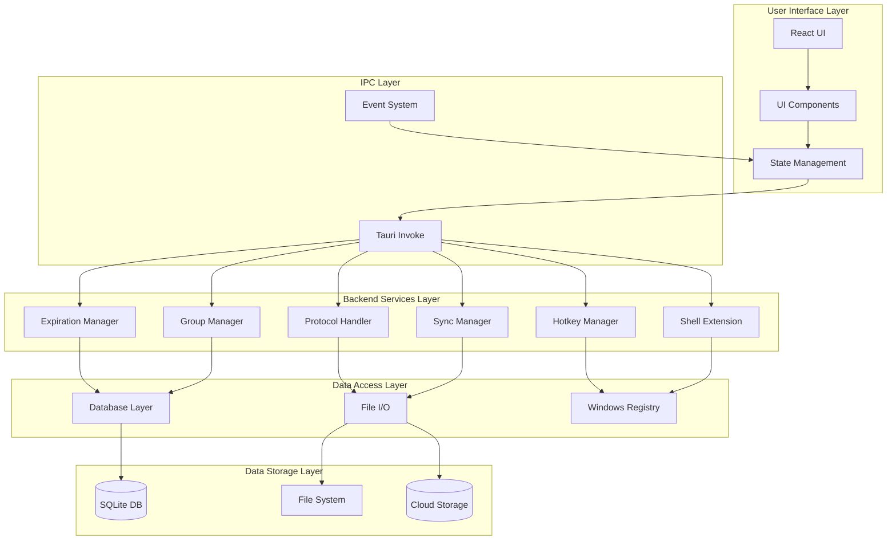
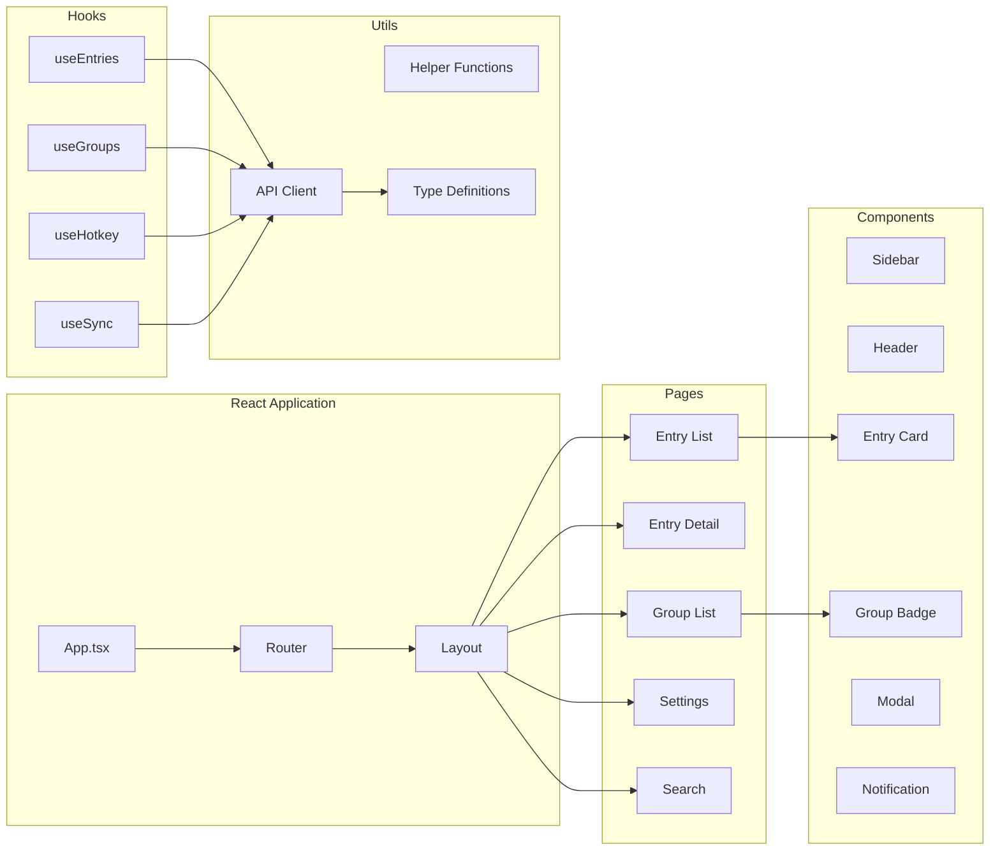
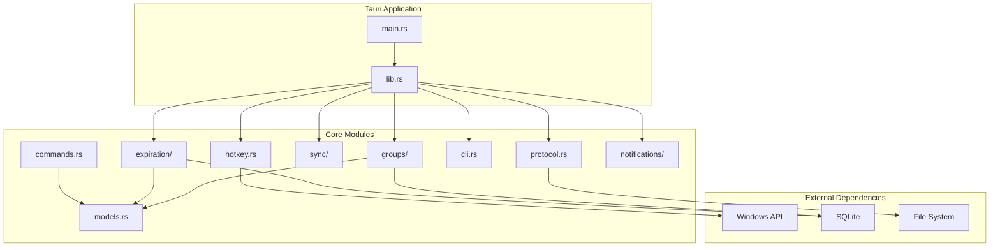
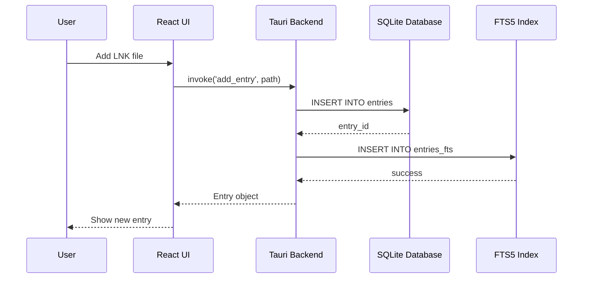
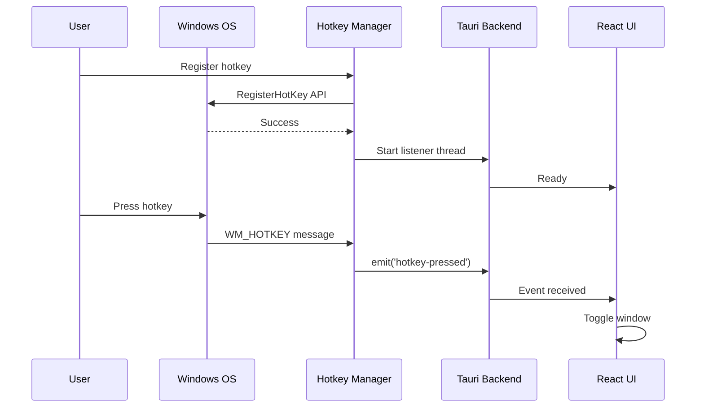
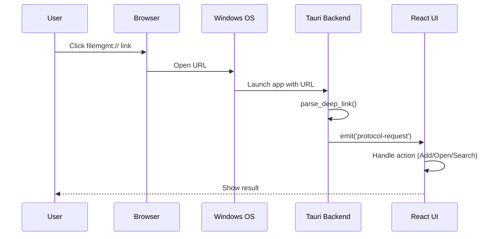
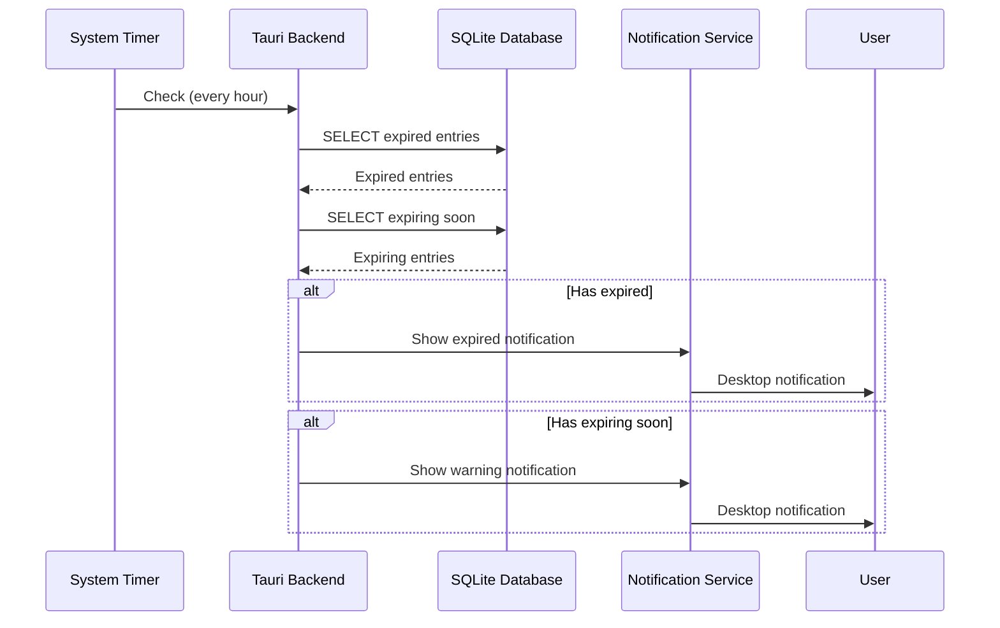
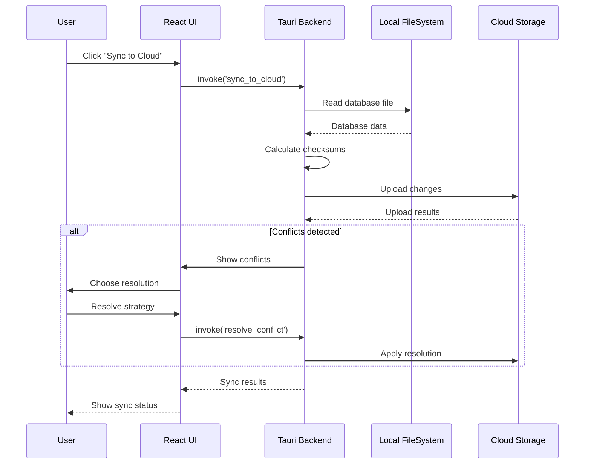
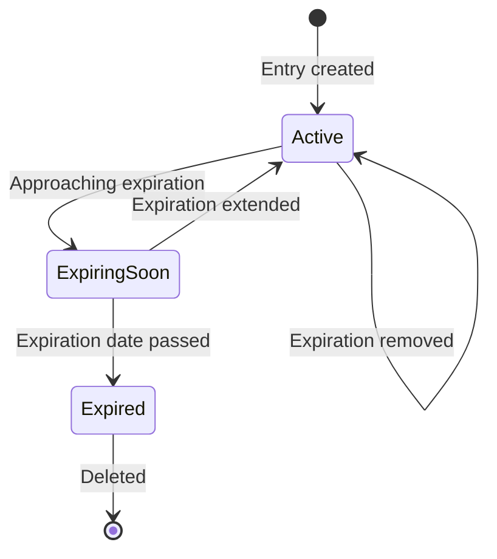

# System Architecture

This document provides a detailed overview of LNK File Management Center's system architecture, components, and design decisions.

## High-Level Architecture



## Component Architecture

### Frontend Architecture



### Backend Architecture



## Data Flow Diagrams

### Entry Creation Flow



### Global Hotkey Flow



### Deep Link Protocol Flow



### Expiration Check Flow



### Cloud Sync Flow



## Component Design

### Hotkey Manager

**Purpose**: Manage global Windows hotkeys for window activation.

**Design**:
- Single-threaded listener running in separate thread
- Mutex-protected state shared with main thread
- Windows API integration for hotkey registration
- Configuration persistence in registry

**Key Features**:
- Hotkey conflict detection
- Dynamic reconfiguration
- Thread-safe event emission

**Implementation**:
```rust
pub struct HotkeyManager {
    hotkey_id: Option<i32>,
    current_hotkey: Option<HotkeyConfig>,
    receiver: Option<Receiver<HotkeyEvent>>,
}

impl HotkeyManager {
    pub fn register(&mut self, modifiers: &[String], key: &str) -> Result<()>;
    pub fn unregister(&mut self) -> Result<()>;
    pub fn check_conflict(&self, modifiers: &[String], key: &str) -> Result<bool>;
    pub fn start_listener(&mut self, app_handle: AppHandle) -> Result<()>;
}
```

### Protocol Handler

**Purpose**: Handle deep link protocol (filemgmt://) for system integration.

**Design**:
- URL parsing with query parameter extraction
- Action routing to appropriate handlers
- Integration with Windows file associations

**Protocol Format**:
```
filemgmt://<action>?<param1>=<value1>&<param2>=<value2>
```

**Supported Actions**:
- `add` - Add a new entry
- `open` - Open an existing entry
- `search` - Search for entries
- `settings` - Open settings

**Implementation**:
```rust
pub enum ProtocolAction {
    Add,
    Open,
    Search,
    Settings,
}

pub struct ProtocolRequest {
    pub action: ProtocolAction,
    pub path: Option<String>,
    pub id: Option<String>,
    pub query: Option<String>,
}

pub fn parse_deep_link(url: &str) -> Result<ProtocolRequest>;
```

### Expiration Manager

**Purpose**: Track and manage entry expiration with notifications.

**Design**:
- Periodic background checks (configurable interval)
- Three-tier status tracking: Expired, Expiring Soon, Not Expiring
- Configurable warning threshold
- Notification integration

**Status Flow**:


**Implementation**:
```rust
pub struct ExpirationManager {
    conn: Connection,
    config: ExpirationConfig,
}

pub enum ExpirationStatus {
    Expired { expired_at: i64 },
    ExpiringSoon { expires_at: i64, days_remaining: i32 },
    NotExpiring,
}
```

### Sync Manager

**Purpose**: Synchronize database and settings with cloud storage.

**Design**:
- Provider-agnostic sync engine
- Bi-directional synchronization
- Conflict detection and resolution
- Sync history tracking

**Supported Providers**:
- OneDrive
- Jianguoyun (坚果云)
- Custom WebDAV (planned)

**Sync Strategy**:
- Last-modified-wins for automatic resolution
- Manual resolution for conflicts
- Atomic operations with rollback

**Implementation**:
```rust
pub struct SyncManager {
    provider: CloudProvider,
    sync_path: PathBuf,
    status: Arc<Mutex<SyncStatus>>,
}

pub enum CloudProvider {
    OneDrive,
    Jianguoyun,
    WebDAV,
}
```

### Group Manager

**Purpose**: Organize entries into user-defined groups.

**Design**:
- Many-to-many relationship model
- Color-coded visual identification
- Batch operations support
- Import/Export functionality

**Implementation**:
```rust
pub struct GroupManager {
    conn: Connection,
}

impl GroupManager {
    pub fn create_group(&self, name: &str, color: &str) -> Result<Group>;
    pub fn add_entry_to_group(&self, entry_id: i64, group_id: i64) -> Result<()>;
    pub fn batch_add(&self, entry_ids: &[i64], group_id: i64) -> Result<()>;
    pub fn export_group(&self, group_id: i64) -> Result<String>;
}
```

### Shell Extension

**Purpose**: Integrate with Windows Explorer context menu.

**Design**:
- Registry-based context menu registration
- PowerShell installation scripts
- Administrator privilege requirement

**Registry Structure**:
```
HKEY_LOCAL_MACHINE\SOFTWARE\Classes\*\shell\AddToFileManagementCenter
    (Default) = "Add to LNK Management Center"
    Icon = "path\to\app.exe"
    command
        (Default) = "path\to\app.exe" --add "%1"
```

## Design Decisions

### 1. Tauri 2.0 Over Electron

**Decision**: Use Tauri instead of Electron.

**Rationale**:
- Smaller bundle size (~3-10MB vs ~150MB)
- Better performance (native backend vs Node.js)
- Lower memory footprint
- Better Windows integration
- Rust's safety guarantees

**Trade-offs**:
- Rust learning curve for web developers
- Smaller ecosystem compared to Node.js
- Less third-party plugin availability

### 2. SQLite Over Server-Based Database

**Decision**: Use SQLite instead of PostgreSQL/MySQL.

**Rationale**:
- Zero configuration for end users
- Embedded database (no server process)
- Excellent performance for local applications
- Full ACID compliance
- Single file storage

**Trade-offs**:
- No concurrent write access from multiple processes
- Limited scalability for very large datasets
- No built-in replication

### 3. Global Hotkey System

**Decision**: Implement system-wide hotkey activation.

**Rationale**:
- Quick access without Alt-Tab
- Consistent user experience across Windows versions
- Native Windows API integration

**Trade-offs**:
- May conflict with other applications
- Requires user configuration
- Platform-specific implementation

### 4. Deep Link Protocol

**Decision**: Implement custom protocol handler (filemgmt://).

**Rationale**:
- Integration with web browsers
- Email/document linking support
- Cross-application integration
- CLI and batch script support

**Trade-offs**:
- Requires protocol registration in Windows
- URL length limitations
- Security considerations for untrusted input

### 5. Expiration Reminder System

**Decision**: Built-in expiration tracking instead of external reminders.

**Rationale**:
- Integrated user experience
- Automatic notifications
- Context-aware actions (extend, delete, ignore)
- Data lifecycle management

**Trade-offs**:
- Increased complexity
- Background resource usage
- Notification spam risk

### 6. Cloud Sync Architecture

**Decision**: File-based sync instead of direct API integration.

**Rationale**:
- Works with any cloud storage provider
- No OAuth/API key management
- User-controlled data location
- Offline capability

**Trade-offs**:
- No real-time sync
- Manual conflict resolution required
- Slower than direct API integration

## Performance Considerations

### Database Optimization

- **Indexes**: Created on frequently queried columns
- **FTS5**: Full-text search with optimized ranking
- **Connection Pooling**: Reuse connections to reduce overhead
- **Transactions**: Batch operations for performance

### Memory Management

- **Rust Ownership**: Automatic memory management without GC
- **RAII Pattern**: Resources automatically cleaned up
- **Smart Pointers**: Arc<Mutex> for shared state
- **Lazy Loading**: Load data on demand

### UI Performance

- **Virtual Scrolling**: Render only visible items
- **Memoization**: Cache expensive computations
- **Debouncing**: Delay rapid updates
- **Code Splitting**: Load components lazily

## Security Architecture

### Data Protection

- **Local Storage**: All data stored locally by default
- **No Telemetry**: No data sent to external servers
- **File Permissions**: User-only access to database
- **Path Validation**: Prevent directory traversal attacks

### Windows Integration

- **Registry Isolation**: User-specific registry keys
- **Administrator Privileges**: Required only for shell extension
- **Protocol Registration**: User-level protocol handler

### Network Security

- **HTTPS Only**: Cloud sync uses secure connections
- **No Hardcoded Secrets**: All credentials user-provided
- **Certificate Validation**: Verify SSL/TLS certificates

## Scalability

### Database Capacity

- **Entries**: Supports millions of entries
- **Groups**: No practical limit
- **Search**: Optimized FTS5 with ranking

### Performance at Scale

- **Indexing**: Maintains query performance
- **Pagination**: Load entries in chunks
- **Lazy Loading**: Load details on demand

## Extensibility

### Plugin System (Planned)

Future versions may support:
- Custom entry types
- External data sources
- Theme customization
- Workflow automation

### API Extension

Backend can be extended by:
- Adding new Tauri commands
- Creating new modules
- Integrating external libraries
- Adding new protocol actions

## Related Documentation

- **[Database Schema](./database-schema.md)** - Data layer details
- **[API Reference](./api.md)** - Backend interface
- **[Build & Deploy](./build-deploy.md)** - Deployment architecture