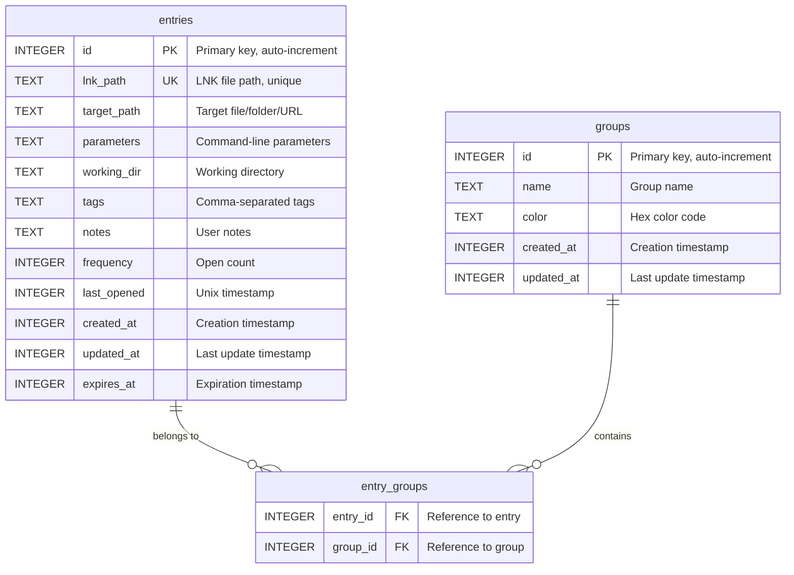

# Database Schema Documentation

This document describes the database schema for LNK File Management Center.

## Overview

LNK File Management Center uses SQLite as its local database engine, providing:
- Zero-configuration embedded database
- Full ACID compliance
- Cross-platform compatibility
- Excellent performance for local applications

**Database Location**: `%APPDATA%/wang.station/app/For_Your_File/lnk_management.db`

## Entity-Relationship Diagram



## Tables

### `entries`

The main table storing LNK file entries.

| Column | Type | Constraints | Description |
|--------|------|-------------|-------------|
| `id` | INTEGER | PRIMARY KEY, AUTOINCREMENT | Unique identifier |
| `lnk_path` | TEXT | NOT NULL, UNIQUE | Full path to the LNK file |
| `target_path` | TEXT | NOT NULL | Path to the target (file/folder/URL) |
| `parameters` | TEXT | NULL | Command-line parameters |
| `working_dir` | TEXT | NULL | Working directory for execution |
| `tags` | TEXT | NULL | Comma-separated tags |
| `notes` | TEXT | NULL | User-provided notes |
| `frequency` | INTEGER | DEFAULT 0 | Number of times opened |
| `last_opened` | INTEGER | NULL | Unix timestamp of last open |
| `created_at` | INTEGER | NOT NULL | Unix timestamp of creation |
| `updated_at` | INTEGER | NOT NULL | Unix timestamp of last update |
| `expires_at` | INTEGER | NULL | Unix timestamp of expiration |

**SQL Definition:**
```sql
CREATE TABLE entries (
    id INTEGER PRIMARY KEY AUTOINCREMENT,
    lnk_path TEXT NOT NULL UNIQUE,
    target_path TEXT NOT NULL,
    parameters TEXT,
    working_dir TEXT,
    tags TEXT,
    notes TEXT,
    frequency INTEGER DEFAULT 0,
    last_opened INTEGER,
    created_at INTEGER NOT NULL,
    updated_at INTEGER NOT NULL,
    expires_at INTEGER
);
```

### `groups`

Stores user-defined groups for organizing entries.

| Column | Type | Constraints | Description |
|--------|------|-------------|-------------|
| `id` | INTEGER | PRIMARY KEY, AUTOINCREMENT | Unique identifier |
| `name` | TEXT | NOT NULL | Group name |
| `color` | TEXT | NOT NULL | Hex color code (e.g., #FF5733) |
| `created_at` | INTEGER | NOT NULL | Unix timestamp of creation |
| `updated_at` | INTEGER | NOT NULL | Unix timestamp of last update |

**SQL Definition:**
```sql
CREATE TABLE groups (
    id INTEGER PRIMARY KEY AUTOINCREMENT,
    name TEXT NOT NULL,
    color TEXT NOT NULL,
    created_at INTEGER NOT NULL,
    updated_at INTEGER NOT NULL
);
```

### `entry_groups`

Junction table implementing many-to-many relationship between entries and groups.

| Column | Type | Constraints | Description |
|--------|------|-------------|-------------|
| `entry_id` | INTEGER | NOT NULL, FOREIGN KEY | Reference to entry |
| `group_id` | INTEGER | NOT NULL, FOREIGN KEY | Reference to group |

**SQL Definition:**
```sql
CREATE TABLE entry_groups (
    entry_id INTEGER NOT NULL,
    group_id INTEGER NOT NULL,
    FOREIGN KEY (entry_id) REFERENCES entries(id) ON DELETE CASCADE,
    FOREIGN KEY (group_id) REFERENCES groups(id) ON DELETE CASCADE,
    PRIMARY KEY (entry_id, group_id)
);
```

## Indexes

### `idx_entries_expires_at`
**Purpose**: Quickly find entries by expiration date for the expiration reminder system.

```sql
CREATE INDEX IF NOT EXISTS idx_entries_expires_at ON entries(expires_at);
```

**Usage**: Used by queries like:
```sql
SELECT * FROM entries
WHERE expires_at IS NOT NULL AND expires_at < ?
ORDER BY expires_at ASC;
```

### `idx_entries_last_opened`
**Purpose**: Optimize queries for most frequently/recently used entries.

```sql
CREATE INDEX IF NOT EXISTS idx_entries_last_opened ON entries(last_opened DESC);
```

**Usage**: Used by queries like:
```sql
SELECT * FROM entries
ORDER BY last_opened DESC
LIMIT 10;
```

### `idx_entry_groups_entry_id`
**Purpose**: Optimize queries to find all groups for an entry.

```sql
CREATE INDEX IF NOT EXISTS idx_entry_groups_entry_id ON entry_groups(entry_id);
```

### `idx_entry_groups_group_id`
**Purpose**: Optimize queries to find all entries in a group.

```sql
CREATE INDEX IF NOT EXISTS idx_entry_groups_group_id ON entry_groups(group_id);
```

## Full-Text Search (FTS5)

LNK File Management Center uses SQLite's FTS5 extension for full-text search capabilities.

### Virtual Table: `entries_fts`

```sql
CREATE VIRTUAL TABLE entries_fts USING fts5(
    lnk_path,
    target_path,
    tags,
    notes,
    content=entries,
    content_rowid=id
);
```

**Searchable Columns**:
- `lnk_path` - LNK file path
- `target_path` - Target path
- `tags` - Tags
- `notes` - User notes

**Usage Example**:
```sql
SELECT e.*
FROM entries e
JOIN entries_fts fts ON e.id = fts.rowid
WHERE entries_fts MATCH ?
ORDER BY rank;
```

### FTS5 Triggers

**Insert Trigger**:
```sql
CREATE TRIGGER entries_ai AFTER INSERT ON entries BEGIN
    INSERT INTO entries_fts(rowid, lnk_path, target_path, tags, notes)
    VALUES (new.id, new.lnk_path, new.target_path, new.tags, new.notes);
END;
```

**Delete Trigger**:
```sql
CREATE TRIGGER entries_ad AFTER DELETE ON entries BEGIN
    INSERT INTO entries_fts(entries_fts, rowid, lnk_path, target_path, tags, notes)
    VALUES ('delete', old.id, old.lnk_path, old.target_path, old.tags, old.notes);
END;
```

**Update Trigger**:
```sql
CREATE TRIGGER entries_au AFTER UPDATE ON entries BEGIN
    INSERT INTO entries_fts(entries_fts, rowid, lnk_path, target_path, tags, notes)
    VALUES ('delete', old.id, old.lnk_path, old.target_path, old.tags, old.notes);
    INSERT INTO entries_fts(rowid, lnk_path, target_path, tags, notes)
    VALUES (new.id, new.lnk_path, new.target_path, new.tags, new.notes);
END;
```

## Relationships

### Entry to Groups (Many-to-Many)

- An entry can belong to multiple groups
- A group can contain multiple entries
- Implemented via `entry_groups` junction table

**Example Query**:
```sql
-- Get all groups for an entry
SELECT g.*
FROM groups g
JOIN entry_groups eg ON g.id = eg.group_id
WHERE eg.entry_id = ?;

-- Get all entries in a group
SELECT e.*
FROM entries e
JOIN entry_groups eg ON e.id = eg.entry_id
WHERE eg.group_id = ?;
```

## Data Types

### Timestamps

All timestamps are stored as INTEGER Unix timestamps (seconds since 1970-01-01 00:00:00 UTC).

**Conversion Examples (Rust)**:
```rust
use chrono::{Utc, DateTime};

// Current timestamp
let now = Utc::now().timestamp();

// From timestamp to DateTime
let dt = DateTime::from_timestamp(timestamp, 0).unwrap();
```

### Colors

Group colors are stored as TEXT in hex format: `#RRGGBB`

**Example**: `#FF5733`, `#3498DB`, `#2ECC71`

## Migration History

### Version 1.0 - Initial Schema

**Date**: 2026-07

**Changes**:
- Created `entries` table
- Created `groups` table
- Created `entry_groups` junction table
- Created FTS5 virtual table `entries_fts`
- Created indexes for performance
- Created triggers for FTS synchronization

**Migration Script**:
```sql
-- Create main tables
CREATE TABLE entries (
    id INTEGER PRIMARY KEY AUTOINCREMENT,
    lnk_path TEXT NOT NULL UNIQUE,
    target_path TEXT NOT NULL,
    parameters TEXT,
    working_dir TEXT,
    tags TEXT,
    notes TEXT,
    frequency INTEGER DEFAULT 0,
    last_opened INTEGER,
    created_at INTEGER NOT NULL,
    updated_at INTEGER NOT NULL,
    expires_at INTEGER
);

CREATE TABLE groups (
    id INTEGER PRIMARY KEY AUTOINCREMENT,
    name TEXT NOT NULL,
    color TEXT NOT NULL,
    created_at INTEGER NOT NULL,
    updated_at INTEGER NOT NULL
);

CREATE TABLE entry_groups (
    entry_id INTEGER NOT NULL,
    group_id INTEGER NOT NULL,
    FOREIGN KEY (entry_id) REFERENCES entries(id) ON DELETE CASCADE,
    FOREIGN KEY (group_id) REFERENCES groups(id) ON DELETE CASCADE,
    PRIMARY KEY (entry_id, group_id)
);

-- Create indexes
CREATE INDEX idx_entries_expires_at ON entries(expires_at);
CREATE INDEX idx_entries_last_opened ON entries(last_opened DESC);
CREATE INDEX idx_entry_groups_entry_id ON entry_groups(entry_id);
CREATE INDEX idx_entry_groups_group_id ON entry_groups(group_id);

-- Create FTS5 virtual table
CREATE VIRTUAL TABLE entries_fts USING fts5(
    lnk_path,
    target_path,
    tags,
    notes,
    content=entries,
    content_rowid=id
);

-- Create FTS triggers
CREATE TRIGGER entries_ai AFTER INSERT ON entries BEGIN
    INSERT INTO entries_fts(rowid, lnk_path, target_path, tags, notes)
    VALUES (new.id, new.lnk_path, new.target_path, new.tags, new.notes);
END;

CREATE TRIGGER entries_ad AFTER DELETE ON entries BEGIN
    INSERT INTO entries_fts(entries_fts, rowid, lnk_path, target_path, tags, notes)
    VALUES ('delete', old.id, old.lnk_path, old.target_path, old.tags, old.notes);
END;

CREATE TRIGGER entries_au AFTER UPDATE ON entries BEGIN
    INSERT INTO entries_fts(entries_fts, rowid, lnk_path, target_path, tags, notes)
    VALUES ('delete', old.id, old.lnk_path, old.target_path, old.tags, old.notes);
    INSERT INTO entries_fts(rowid, lnk_path, target_path, tags, notes)
    VALUES (new.id, new.lnk_path, new.target_path, new.tags, new.notes);
END;
```

## Database Connection Management

### Connection Pool

LNK File Management Center uses connection pooling via `r2d2` and `r2d2_sqlite`:

```rust
use r2d2::{Pool, PooledConnection};
use r2d2_sqlite::SqliteConnectionManager;

// Create connection pool
let manager = SqliteConnectionManager::file("lnk_management.db");
let pool = Pool::builder()
    .max_size(5)
    .build(manager)?;

// Get connection from pool
let conn = pool.get()?;
```

**Pool Configuration**:
- Maximum pool size: 5 connections
- Connection timeout: 30 seconds
- Automatic cleanup of expired connections

### Transaction Management

All write operations should use transactions for data integrity:

```rust
let tx = conn.transaction()?;
tx.execute("INSERT INTO entries ...", params)?;
tx.execute("INSERT INTO entry_groups ...", params)?;
tx.commit()?;
```

## Performance Considerations

### Indexing Strategy

- **Primary keys**: Automatically indexed
- **Foreign keys**: Indexed for JOIN performance
- **Search fields**: Indexed for WHERE clause performance
- **FTS**: Optimized for full-text search

### Query Optimization

- Use prepared statements for repeated queries
- Use transactions for bulk operations
- Leverage indexes with proper WHERE clauses
- Use FTS5 for text search instead of LIKE

### Storage Efficiency

- TEXT fields use variable-length storage
- INTEGER fields use 1-8 bytes based on value
- NULL values consume minimal space
- Foreign keys enforced with ON DELETE CASCADE

## Backup and Recovery

### Manual Backup

```bash
# SQLite backup command
sqlite3 lnk_management.db ".backup backup.db"
```

### Automatic Backup

The application can implement periodic backups:

```rust
use std::fs;

fn backup_database(db_path: &Path) -> Result<()> {
    let backup_path = db_path.with_extension("db.backup");
    fs::copy(db_path, backup_path)?;
    Ok(())
}
```

### Recovery

1. Stop the application
2. Replace corrupted database with backup
3. Restart the application

## Data Integrity

### Foreign Key Constraints

- Enforced with `ON DELETE CASCADE`
- Prevents orphaned records
- Automatic cleanup when parent is deleted

### Unique Constraints

- `lnk_path` must be unique
- Prevents duplicate shortcuts

### NOT NULL Constraints

- Required fields enforced at database level
- Prevents incomplete data entry

## Security Considerations

- Database file permissions: User-only access
- No network exposure
- No sensitive data encryption (stored locally)
- Path validation before insertion

## Next Steps

- See [API Documentation](./api.md) for database operations
- See [Architecture](./architecture.md) for data flow diagrams
- See [Build & Deploy](./build-deploy.md) for database setup